# 🌟 AFK Preschool — Serverless Website on AWS

A fully serverless preschool website built and deployed on AWS. Parents can register their child through an admission form — the data is stored in DynamoDB via a Lambda function triggered by API Gateway. The site is live on a custom domain with HTTPS security.

🌐 **Live Site:** [afkschool.online](https://afkschool.online)

---

## 🏗️ Architecture

```
User visits afkschool.online
        ↓
Route 53 (Custom Domain + DNS)
        ↓
CloudFront (CDN + HTTPS)
        ↓
ACM Certificate (SSL/TLS Security)
        ↓
S3 Bucket (Static Website Hosting)
        ↓
User fills Registration Form
        ↓
API Gateway (REST API - POST /register)
        ↓
Lambda Function (Node.js)
        ↓
DynamoDB (Stores student registration data)
```

---

## ☁️ AWS Services Used

| Service | Purpose |
|---------|---------|
| Amazon S3 | Static website hosting |
| Amazon Route 53 | Custom domain and DNS management |
| AWS Certificate Manager (ACM) | SSL/HTTPS certificate |
| Amazon CloudFront | CDN for fast global delivery |
| Amazon API Gateway | REST API to handle form submissions |
| AWS Lambda | Serverless backend logic (Node.js) |
| Amazon DynamoDB | NoSQL database for student registrations |
| AWS WAF & Shield | Web application firewall and DDoS protection |

---

## ✨ Features

- Responsive preschool website with modern UI
- Online student admission/registration form
- Serverless backend — no EC2 or traditional server
- Real-time form data stored in DynamoDB
- Custom domain with SSL/HTTPS security
- CloudFront CDN for fast load times globally
- WAF protection against malicious traffic
- SEO optimized — indexed on Google Search

---

## 📸 Screenshots

### 🔍 Indexed on Google Search
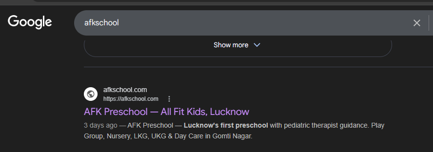

### 🌐 Website Homepage
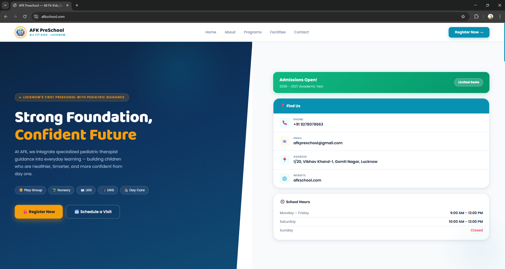

### 📋 Registration Page
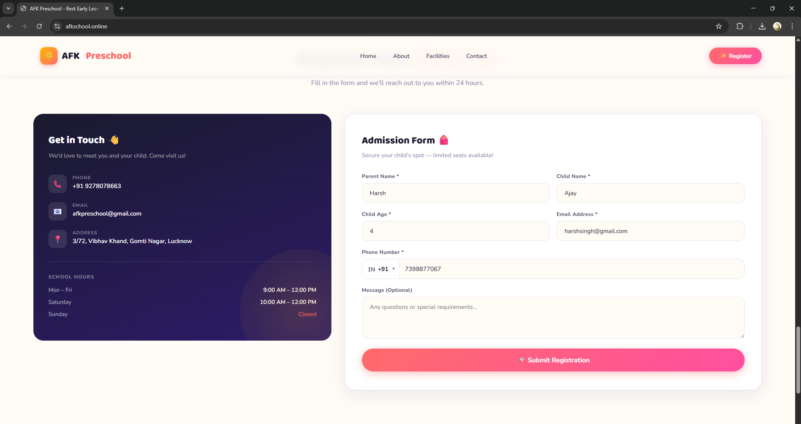

### ✅ Form Submission Success
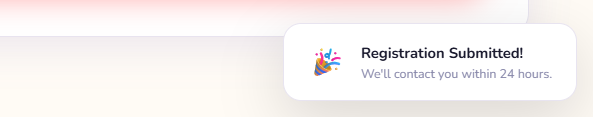

### 🗄️ DynamoDB — Real Student Data
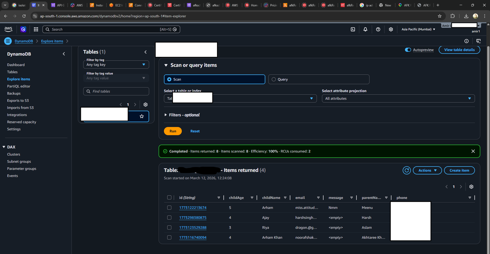

### ⚡ Lambda Function (Node.js)
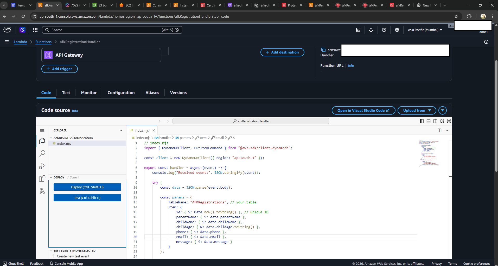

### ⚙️ API Gateway — POST /register Route
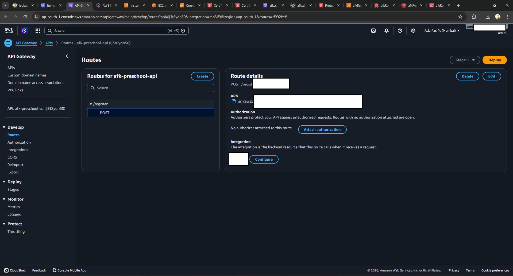

### 🪣 S3 Bucket
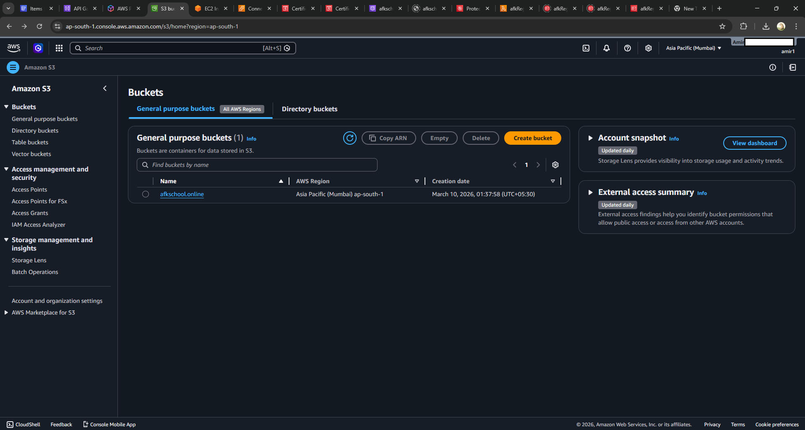

### 🔒 ACM SSL Certificate
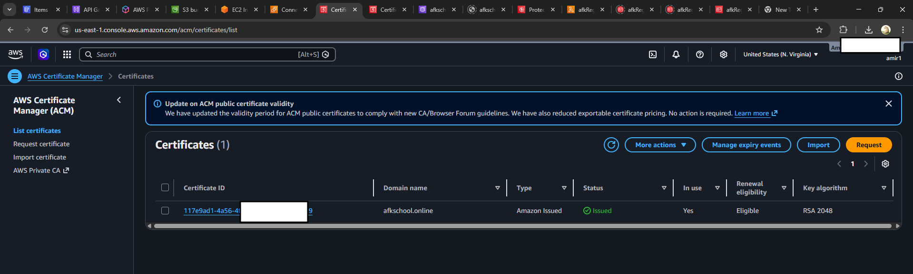

### 🌍 Route 53 — DNS Configuration
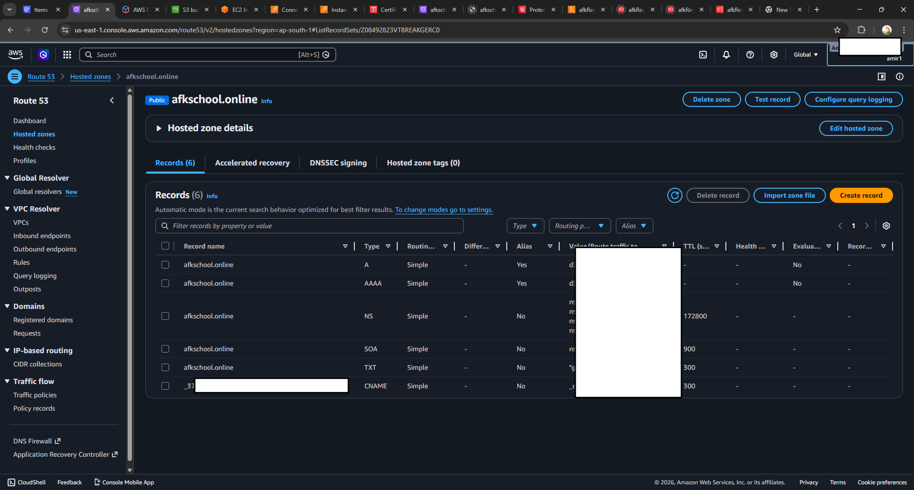

### ☁️ Cloudfront
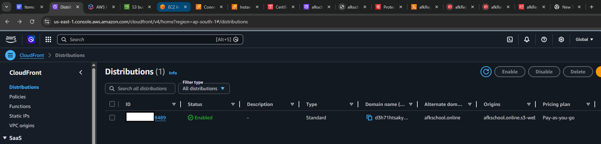

### 🛡️ WAF & Shield Protection
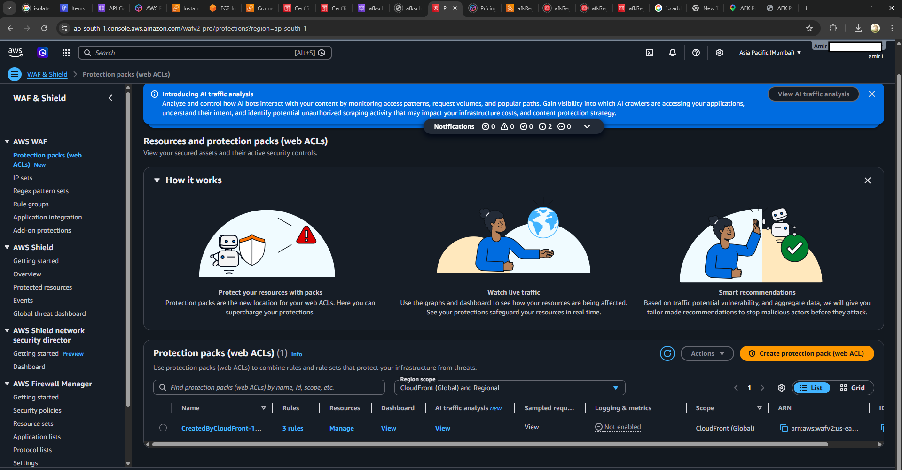

---

## 🛠️ Project Structure

```
Serverless-Preschool-Website/
│
├── index.html            # Main HTML structure
├── config.example.js     # API config template (copy to config.js)
├── .gitignore
│
├── css/
│   └── style.css         # All styling and animations
│
├── js/
│   └── main.js           # Form logic, API calls, animations
│
└── screenshots/          # AWS console and website proof
```

---

## ⚙️ How It Works

1. User opens the website at `afkschool.online`
2. Route 53 routes the request, CloudFront serves the site via CDN
3. ACM certificate ensures secure HTTPS connection
4. S3 hosts the static HTML/CSS/JS files
5. Parent fills the admission form and clicks Submit
6. JavaScript sends a POST request to API Gateway endpoint
7. API Gateway triggers the Lambda function
8. Lambda parses the form data and stores it in DynamoDB
9. User sees a success toast — registration complete!

---

## 🔐 Security

- API Gateway URL stored in `config.js` which is gitignored
- IAM roles configured with least-privilege access
- WAF rules protect against common web attacks
- SSL/TLS encryption via ACM on all traffic
- Sensitive AWS account details hidden in all screenshots

---

## 📌 Note

This is a real client project built for AFK Preschool, Lucknow.
The `config.js` file containing the live API endpoint is not included in this repo for security reasons.
Refer to `config.example.js` for the configuration structure.

---

## 👨‍💻 Built By

**Amir Khan** — Cloud & DevOps Engineer  
🔗 [linkedin.com/in/amirkhan](linkedin.com/in/amir-khan-6ab830237)  
📧 khan.amir07862@gmail.com
