# 🌟 AFK Preschool — Serverless Website on AWS

A fully serverless preschool website built and deployed on AWS. Parents can register their child through an admission form. Admins can manage a student activity gallery with secure MFA login. All data flows through AWS serverless services — no EC2, no traditional server.

🌐 **Live Site:** [afkschool.com](https://afkschool.com)

---

## 🏗️ Architecture

### Original Registration Flow
```
User visits afkschool.com
        ↓
Route 53 (Custom Domain + DNS)
        ↓
CloudFront (CDN + HTTPS + WAF)
        ↓
S3 Bucket (Static Website — index.html, gallery.html, admin.html)
        ↓
User fills Registration Form
        ↓
API Gateway (HTTP API - POST /register)
        ↓
Lambda Function (Node.js)
        ↓
DynamoDB (Stores student registration data)
```

### New Gallery Flow
```
Admin opens admin.html
        ↓
Enters Username + Password (client-side validation)
        ↓
API Gateway (POST /gallery-otp)
        ↓
Lambda — afkOTPHandler (generates 6-digit OTP)
        ↓
AWS SES (sends OTP to admin Gmail)
        ↓
Admin enters OTP → verified → logged in
        ↓
Admin uploads photo (drag & drop)
        ↓
API Gateway (POST /gallery)
        ↓
Lambda — afkGalleryHandler
        ↓
S3 Bucket — afkschool-gallery (stores photo)
        ↓
DynamoDB — afk-gallery-photos (stores URL + caption + date)
        ↓
gallery.html fetches photos → displays masonry grid
```

---

## ☁️ AWS Services Used

| Service | Purpose |
|---------|---------|
| Amazon S3 (Website) | Static website hosting — HTML/CSS/JS files |
| Amazon S3 (Gallery) | Photo storage — afkschool-gallery bucket |
| Amazon Route 53 | Custom domain and DNS management |
| AWS Certificate Manager (ACM) | SSL/HTTPS certificate (us-east-1) |
| Amazon CloudFront | CDN for fast global delivery + cache invalidation |
| Amazon API Gateway (HTTP API) | 3 separate APIs — /register, /gallery, /gallery-otp |
| AWS Lambda (Node.js 20.x) | 3 functions — registration, gallery CRUD, OTP handler |
| Amazon DynamoDB | 2 tables — registrations + gallery photo metadata |
| Amazon SES | OTP email delivery for admin MFA login |
| AWS WAF | Web application firewall — DDoS, XSS, SQLi protection |
| AWS IAM | Least-privilege roles for all Lambda functions |
| Amazon CloudWatch | Lambda logs and monitoring |

---

## ✨ Features

### 🌐 Public Website
- Responsive preschool website with modern UI
- Online student admission/registration form
- Serverless backend — no EC2 or traditional server
- Real-time form data stored in DynamoDB
- Custom domain with SSL/HTTPS security
- CloudFront CDN for fast load times globally
- WAF protection against malicious traffic
- SEO optimized — indexed on Google Search
- Mobile responsive with hamburger menu

### 📸 Student Gallery
- Public gallery page with masonry photo grid
- Filter photos by activity/caption tabs
- Lightbox viewer with keyboard navigation (←→ Esc)
- Smooth animations and hover effects

### 🔐 Admin Panel (admin.html)
- Username + Password authentication
- MFA via OTP — 6-digit code sent to admin Gmail via AWS SES
- Account lockout after 5 failed attempts (15 min cooldown)
- Drag & drop photo upload with preview
- Upload multiple photos with captions and dates
- Real-time upload progress bar
- Delete photos (removes from S3 + DynamoDB)
- View total photos and activity count

---

## 🔧 Technical Highlights

### HTTP API vs REST API Event Format
Lambda code handles both API types using optional chaining:
```javascript
const method = event.requestContext?.http?.method || event.httpMethod;
const path   = event.rawPath || event.path;
```

### Photo Upload Flow (Base64 → S3)
```javascript
// Frontend: convert file to base64
const imageData = await fileToBase64(file); // data:image/png;base64,...

// Lambda: decode and upload to S3
const base64 = imageData.replace(/^data:image\/\w+;base64,/, "");
const buffer = Buffer.from(base64, "base64");
await S3.send(new PutObjectCommand({ Bucket, Key, Body: buffer, ContentType }));
```

### API Gateway URL Structure (HTTP API)
```
Full URL = API_ID + /STAGE + /ROUTE
https://tfb30nked9.execute-api.ap-south-1.amazonaws.com/gallery/gallery
                                                         ↑stage  ↑route
```

### OTP Security Flow
```
Login attempt → credentials match → POST /gallery-otp (action: send)
→ Lambda generates 6-digit OTP → stores in memory with 10min expiry
→ SES sends styled HTML email → Admin enters OTP
→ POST /gallery-otp (action: verify) → match → session granted
```

---

## 📸 Screenshots

### 🔍 Indexed on Google Search
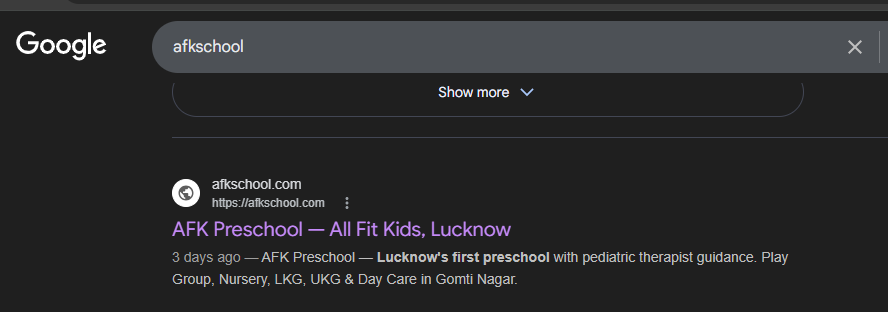

### 🌐 Website Homepage
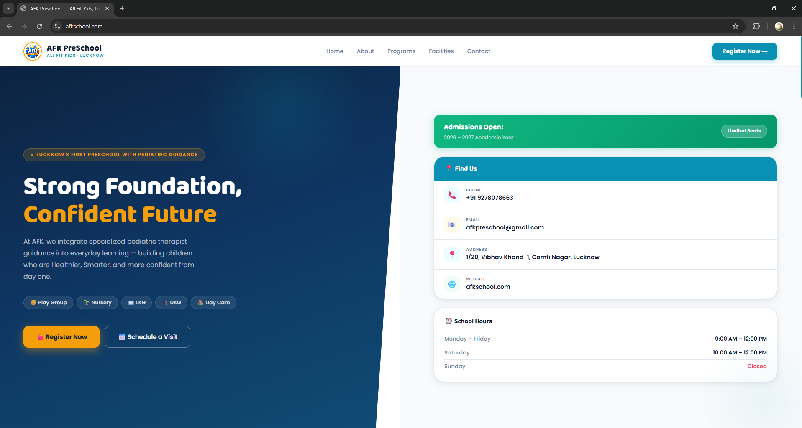

### 📋 Registration Page
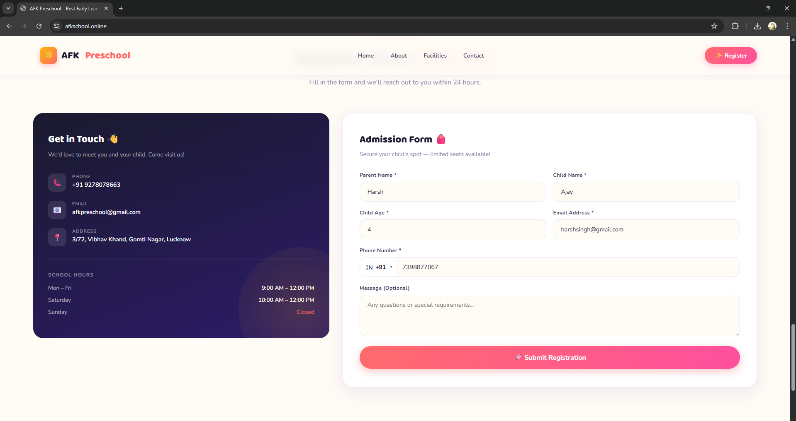

### ✅ Form Submission Success
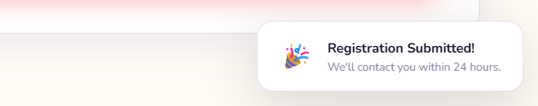

### 📸 Student Gallery Page
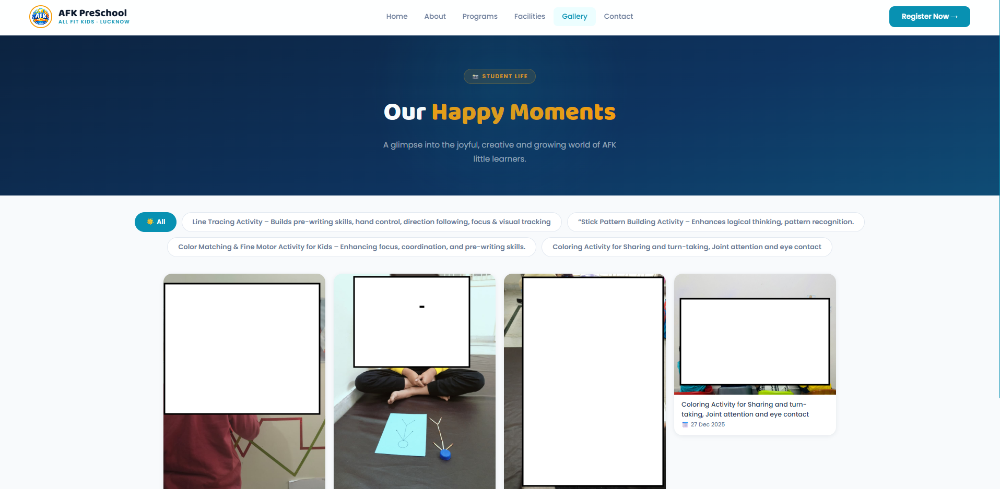

### 🔐 Admin Login — OTP Screen


### 🖼️ Admin Panel — Upload Photos
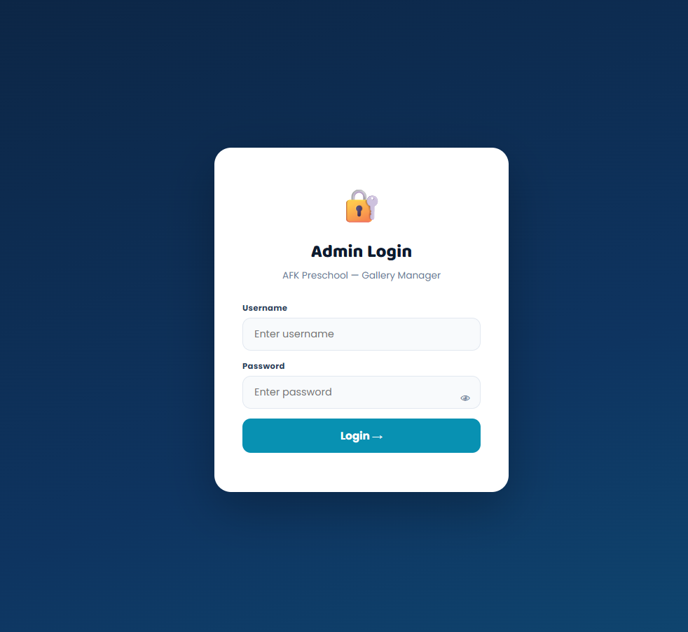

### 🗄️ DynamoDB — Registration Data
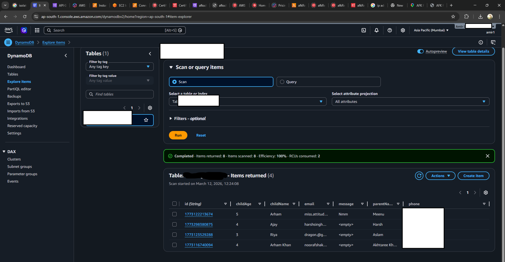

### 🗄️ DynamoDB — Gallery Photos Table
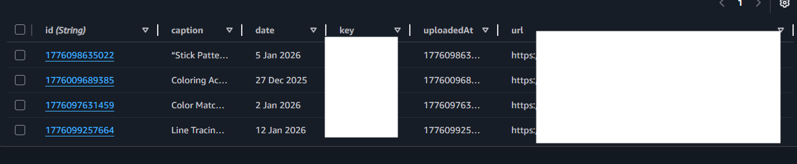

### ⚡ Lambda — Gallery Handler


### ⚡ Lambda — OTP Handler


### ⚙️ API Gateway — Gallery Routes


### 🪣 S3 — Gallery Bucket


### 📧 SES — Verified Identity


### ⚡ Lambda Function (Registration)
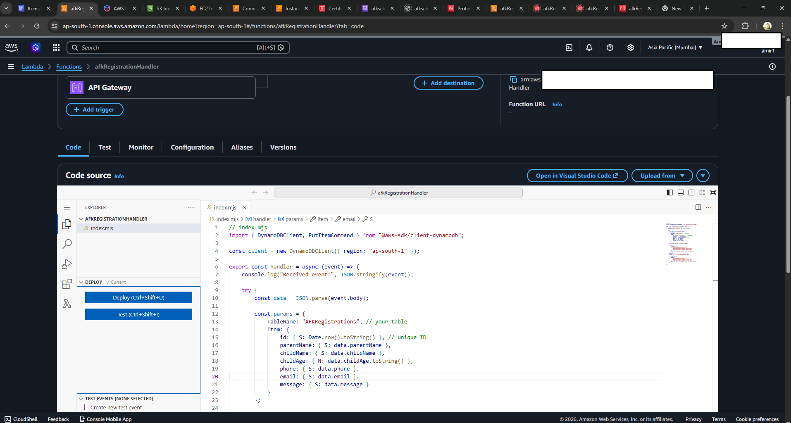

### ⚙️ API Gateway — POST /register Route
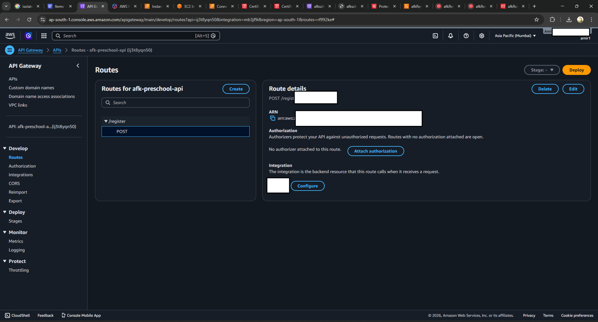

### 🪣 S3 Bucket (Website)
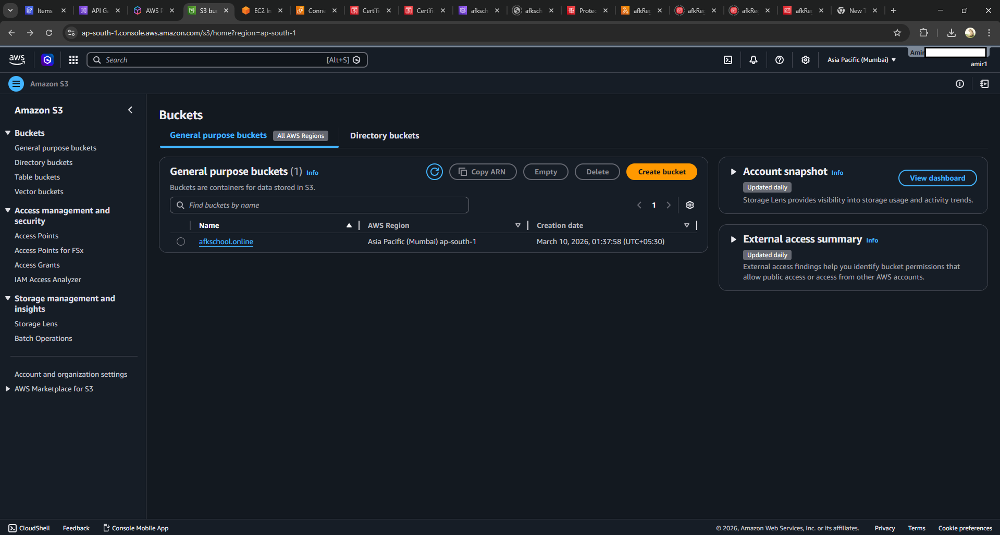

### 🔒 ACM SSL Certificate
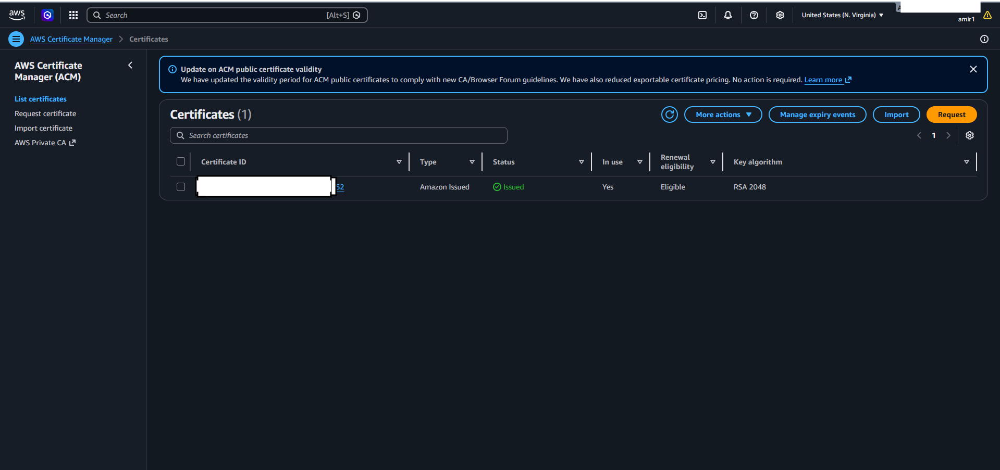

### 🌍 Route 53 — DNS Configuration
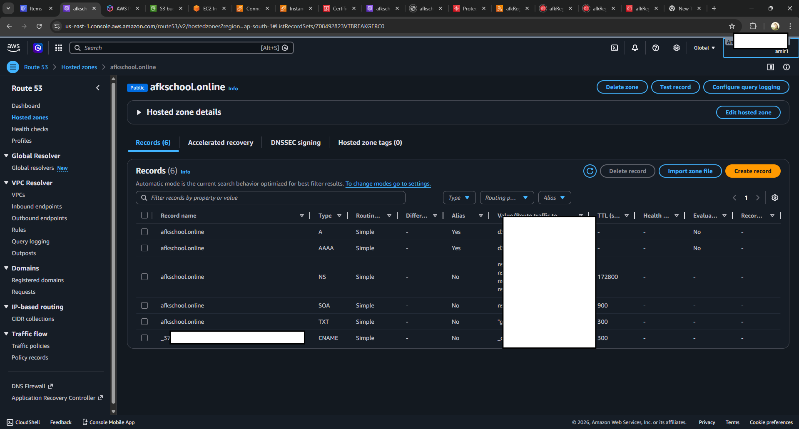

### ☁️ CloudFront Distribution
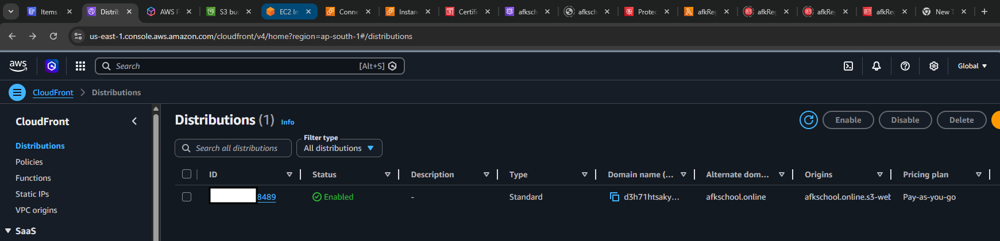

### 🛡️ WAF Protection
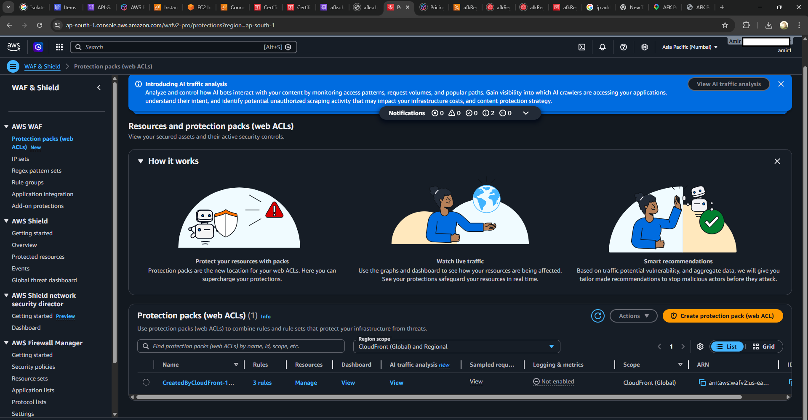

---

## 🛠️ Project Structure

```
Serverless-Preschool-Website/
│
├── index.html              # Main website
├── gallery.html            # Public student gallery
├── admin.html              # Admin panel (MFA protected)
├── logo.jpeg               # School logo
├── .gitignore
│
└── screenshots/            # AWS console and website proof
    ├── OnGoogleSearch.png
    ├── Website_homepage.png
    ├── GalleryPage.png
    ├── AdminOTP.png
    ├── AdminPanel.png
    ├── DynamoDBTable.png
    ├── DynamoDBGallery.png
    ├── LambdaGallery.png
    ├── LambdaOTP.png
    ├── APIGatewayGallery.png
    ├── S3GalleryBucket.png
    ├── SES.png
    └── ...
```

---

## ⚙️ How It Works

### Registration
1. User opens `afkschool.com` → Route 53 → CloudFront → S3
2. Parent fills admission form → JavaScript sends POST to API Gateway
3. Lambda parses data → stores in DynamoDB → success toast shown

### Gallery (Admin)
1. Admin opens `afkschool.com/admin.html`
2. Enters username + password → OTP sent to Gmail via SES
3. Enters OTP → verified → admin panel unlocks
4. Drag & drop photos → Lambda uploads to S3 → metadata saved to DynamoDB
5. Public visitors see photos at `afkschool.com/gallery.html`

---

## 🔐 Security

- Admin panel protected with Username + Password + OTP (MFA)
- Account lockout after 5 failed attempts — 15 minute cooldown
- OTP expires after 10 minutes — single use only
- IAM roles configured with least-privilege access
- S3 website bucket private — accessible only via CloudFront OAC
- S3 gallery bucket — Lambda only has PutObject + DeleteObject
- WAF rules protect against SQL injection, XSS, DDoS
- SSL/TLS encryption via ACM on all traffic
- CORS configured on each API — only afkschool.com allowed
- Sensitive credentials not stored in repo

---

## 🐛 Challenges & Fixes

| Problem | Root Cause | Fix |
|---------|-----------|-----|
| OTP not sending | SES email not verified in ap-south-1 | Verified identity in correct region |
| 404 on gallery API | Stage + route both named "gallery" → URL needed /gallery/gallery | Updated URL to include both stage and route |
| Upload failing silently | Lambda written for REST API format, using HTTP API | Used `event.requestContext?.http?.method \|\| event.httpMethod` |
| CORS error on OTP API | Each API Gateway needs separate CORS config | Configured CORS on all 3 APIs individually |
| Old files showing after update | CloudFront cache serving stale files | Used `/*` invalidation after each S3 upload |

---

## 📌 Note

This is a real client project built for AFK Preschool, Lucknow.
API endpoints and admin credentials are not included in this repo for security reasons.
All AWS service configurations shown in screenshots folder.

---

## 👨‍💻 Built By

**Amir Khan** — Cloud & DevOps Engineer
🔗 [linkedin.com/in/amirkhan](https://www.linkedin.com/in/amir-khan-6ab830237/)
📧 khan.amir07862@gmail.com
